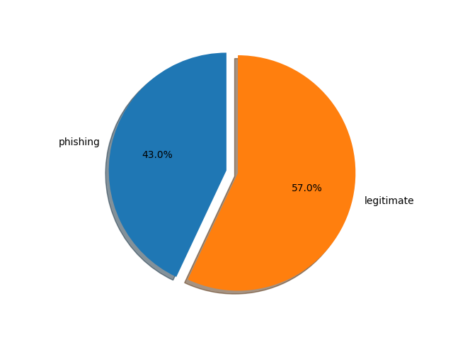
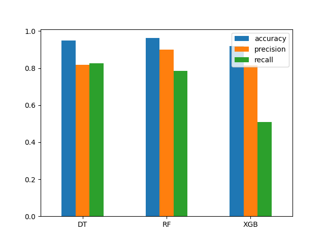

# Phishing Sentinel

Phishing Sentinel is a Django-based web application designed to detect phishing websites using machine learning models. This project leverages a content-based approach to analyze and classify websites as either legitimate or phishing.

## Table of Contents

- [Introduction](#introduction)
- [Features](#features)
- [Installation](#installation)
- [Usage](#usage)
- [Dataset](#dataset)
- [Models](#models)

## Introduction

Phishing Sentinel is an educational project aimed at demonstrating how machine learning can be used to identify phishing websites. The application uses several machine learning models trained on a dataset of legitimate and phishing websites.

## Features

- **User Input**: Users can input a URL to check if it's a phishing website.
- **Model Selection**: Users can select from different machine learning models (e.g., Decision Tree, Random Forest, XGBoost).
- **Real-time Prediction**: The application provides real-time predictions on the legitimacy of the input URL.
- **Detailed Insights**: Provides detailed information on how the decision was made based on the content of the website.
- **Interactive UI**: User-friendly interface built with Bootstrap for easy navigation and interaction.

## Installation

### Prerequisites

- Python 3.x
- Django 3.x or higher
- Git

### Steps

1. **Clone the repository**:

    ```sh
    git clone https://github.com/yourusername/phishing-sentinel.git
    cd phishing-sentinel
    ```

2. **Create a virtual environment and activate it**:

    ```sh
    python -m venv venv
    source venv/bin/activate  # On Windows, use `venv\Scripts\activate`
    ```

3. **Install the required packages**:

    ```sh
    pip install -r requirements.txt
    ```

4. **Apply migrations**:

    ```sh
    python manage.py migrate
    ```

5. **Run the development server**:

    ```sh
    python manage.py runserver
    ```

6. **Open your browser** and go to `http://127.0.0.1:8000`.

## Usage

1. **Navigate to the home page** and enter a URL in the provided input field.
2. **Select a machine learning model** from the dropdown menu.
3. **Click the 'Check' button** to get the prediction on whether the website is legitimate or phishing.

## Dataset

The dataset used for this project is composed of both legitimate and phishing websites. Data was collected using various sources and features were extracted from the HTML content of the websites.

- **Legitimate Websites**: Data sourced from tranco-list.eu's "top-1M.csv".
- **Phishing Websites**: Data sourced from "PhiUSIIL_Phishing_URL_Dataset".
 

The dataset includes 43 features and consists of 37,798 websites, out of which 21,266 are legitimate and 16,532 are phishing websites.

## Models

The application uses several machine learning models, including:

- **Decision Tree**
- **Random Forest**
- **XGBoost Classifier**
- Each model has been evaluated based on accuracy, precision, and recall using K-fold cross-validation.
 
